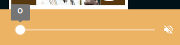
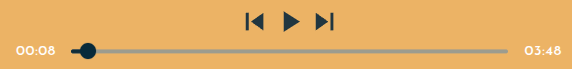

# jazzi
This is a project using next JS that have the purpose to be a music player specialized in the one of the most elegant genders of music, the jazz.

## Stacks
For this NextJs is used as framework with sass and tailwind for styling.

Using next, the SWC is used for as compiler and postcss is responsable for processing styles.

To control the audio player the react-audio-player is used, but the commands of the player .

## Images of the application:\
\
Full volume:\
\
Half of the volume:\
\
Muted:\
\
Time progress bar:\
\
Thumbnail:\
\
