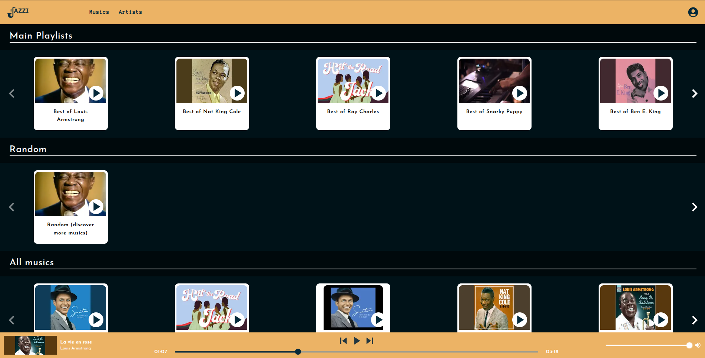
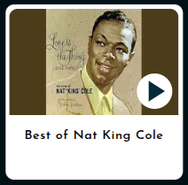

# Jazzi

This project is built with Next.js and serves as a music player dedicated to one of the most elegant genres of music — jazz.

## Tech Stack

The project uses Next.js as the framework, with Sass and Tailwind CSS for styling.

Next.js uses SWC as its compiler, and PostCSS is responsible for processing styles.

To control audio playback, the project uses react-audio-player, which handles the player’s commands.

```
# Important
Unfortunately, Vercel doesn’t allow me to host this project on its infrastructure (so sad 😢), but I took a few screenshots to show you how it looks.
```

## Images of the application:\
\
Full volume:\
\
Half of the volume:\
\
Muted:\
\
Time progress bar:\
\
Thumbnail:\
\
Cards:\

